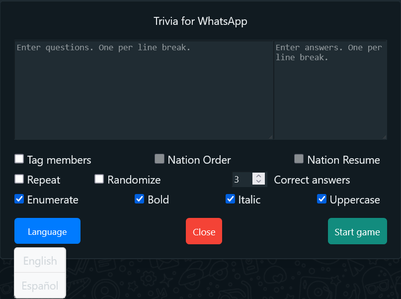
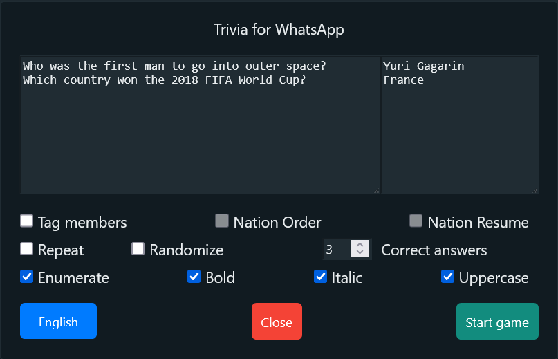

# Trivia game for WhatsApp group

This userscript allows to play a trivia game in a WhatsApp group.

## Usage

1. Install Tampermonkey from the [official website](https://www.tampermonkey.net/) (if you haven’t installed it yet).
2. Add the script to Tampermonkey by [clicking here](https://raw.githubusercontent.com/GiovJ-97/Whatsapp-trivia-script/main/src/main.user.js).
3. Go to [Whatsapp Web](https://web.whatsapp.com/).
4. Open a chat group.
5. Click the `Trivia` button:

6. You will see this screen:

   
7. You can change the language between English and Spanish (English is the default language).

8. Enter the questions and answers. Tip: each line break is interpreted as a new question. For example:

9. Select the options before starting the game, such as:
- `Tag members` to mention all participants in the group before sending a new question.
- `Nation Order` to organize by nationality (many countries in the Americas are included).
- `Nation Resume` for a breakdown of the percentage each nation represents in the group.
- `Repeat` to repeat all the questions.
- `Randomnize` to shuffle the question order.
- `Correct Answers` is the number of correct answers needed to move to the next question. If the game is stuck because fewer correct answers were received, decrease this number and then restore it once a new question is being prepared to be sent.
- `Enumerate` to number all the questions.
- `Bold` to bold all the questions and text.
- `Italic` to italicize all the questions and text.
- `Uppercase` to convert all the questions and text to uppercase.

If you like this project and want to support it, please consider making a donation:

Have a good game!

