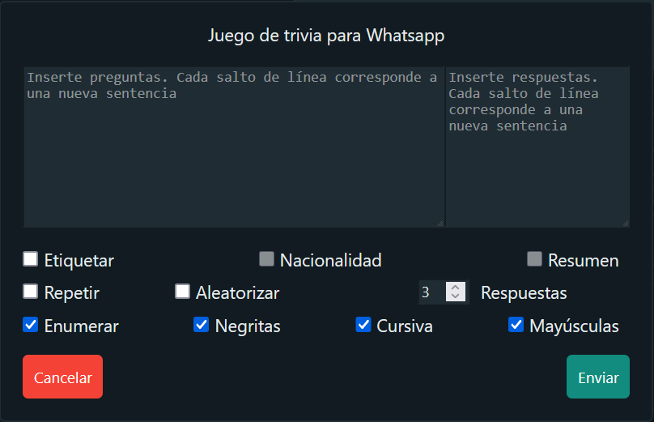

# Trivia game for WhatsApp group

This userscript allows to play a trivia game in a WhatsApp group.

## Usage

1. Install Tampermonkey from the [official website](https://www.tampermonkey.net/) (if you haven’t installed it yet).
2. Add the script to Tampermonkey by [clicking here](https://raw.githubusercontent.com/GiovJ-97/Whatsapp-trivia-script/main/src/main.user.js).
3. Go to [Whatsapp Web](https://web.whatsapp.com/).
4. Open a chat group.
5. Click the `Trivia` button:

7. Play!

If you like this project and want to support it, please consider making a donation:

