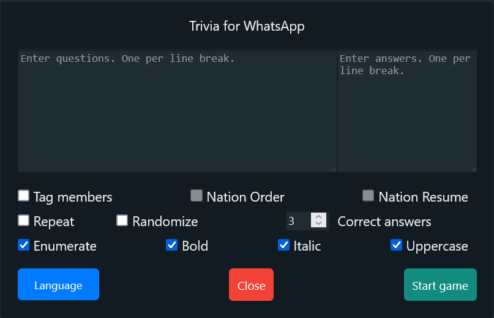

# Trivia game for WhatsApp group

This userscript allows to play a trivia game in the WhatsApp group.

## Usage

1. Install [Tampermonkey](https://www.tampermonkey.net/).
3. Install [the userscript](https://raw.githubusercontent.com/GiovJ-97/Whatsapp-trivia-script/main/src/main.user.js) (add it to Tampermonkey).
4. Go to [Whatsapp Web](https://web.whatsapp.com/).
5. Open a group chat.
6. Push `Trivia` button.

6. Play!

If you like this project and want to support it, please consider making a donation:

