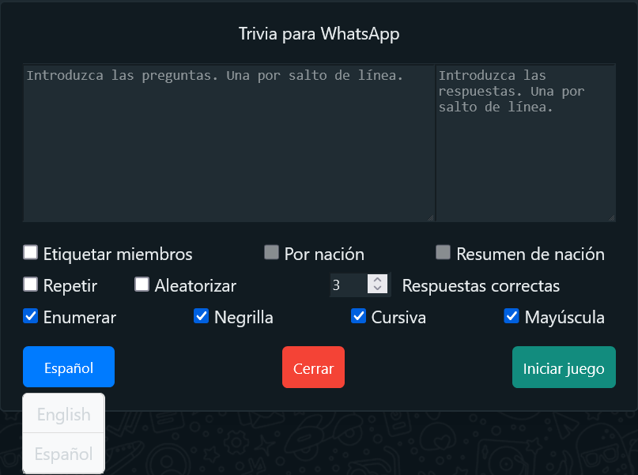

# Juego de trivia para grupo de WhatsApp | 

Este script permite jugar a un juego de trivia en un grupo de WhatsApp.

## Uso

1. Instalar Tampermonkey desde el [sitio web oficial](https://www.tampermonkey.net/) (si aún no lo has instalado).
2. Agregue el script a Tampermonkey haciendo [clic aquí](https://raw.githubusercontent.com/GiovJ-97/Whatsapp-trivia-script/main/src/main.user.js).
3. Habilite el “Modo desarrollador” en su navegador si es necesario.
4. Vaya a [Whatsapp Web](https://web.whatsapp.com/).
5. Abrir un chat de grupo.
6. Haga clic en el botón `Trivia`:

6. Verás esta pantalla:

   
7. Puedes cambiar el idioma entre inglés y español (el inglés es el idioma predeterminado).

8. Introduce las preguntas y respuestas. Consejo: cada salto de línea se interpreta como una nueva pregunta. Por ejemplo:

9. Seleccione las opciones antes de comenzar el juego, como:
- `Etiquetar miembros` para mencionar a todos los participantes del grupo antes de enviar una nueva pregunta.
- `Por nación` para organizar por nacionalidad (se incluyen muchos países de América).
- `Resumen de nación` para obtener un desglose del porcentaje que representa cada nación en el grupo.
- `Repetir` para repetir todas las preguntas.
- `Aleatorizar` para mezclar el orden de las preguntas.
- `Respuestas correctas` es la cantidad de respuestas correctas necesarias para pasar a la siguiente pregunta. Si el juego se bloquea porque se recibieron menos respuestas correctas, disminuya esta cantidad y luego restáurela una vez que se esté preparando una nueva pregunta para enviar.
- `Enumerar` para numerar todas las preguntas.
- `Negrilla` para poner en negrita todas las preguntas y el texto.
- `Cursiva` para poner en cursiva todas las preguntas y el texto.
- `Mayúscula` para convertir todas las preguntas y el texto a mayúsculas.

### Acerca del juego:
1. Una vez que comienza el juego, este script cuenta las respuestas correctas mediante puntos. La primera respuesta correcta gana [`Correct Answers` number + 2] puntos, y las respuestas correctas posteriores ganan [(`Correct Answers` number + 2) - 1] puntos.
2. Cuando se alcanza el número requerido de respuestas correctas, se muestra el marcador. Cuando termina el juego, se muestra el marcador final.
3. Advierte a tus jugadores que es posible que lleguen dos o más respuestas al mismo tiempo y que el script no las detecte. Si esto sucede, los jugadores deben volver a enviar sus respuestas. Sin embargo, si el script muestra `respuesta detectada`, no se requiere ninguna acción adicional por parte del jugador.
5. Los jugadores pueden realizar tantos intentos como quieran, pero advierteles que cada respuesta incorrecta reduce sus puntos en 1.

## Actualización v1.12

Desde la versión 1.12, tendrás dos botones: uno para etiquetar a los miembros del grupo en cualquier momento (especialmente antes de que comience el juego) y otro para omitir la pregunta actual (por ejemplo, si los jugadores no están respondiendo a la pregunta, puedes omitirla):

Si te gusta este proyecto y quieres apoyarlo, considera hacer una donación:

¡Que te diviertas!

